# Exercise 1: Build a Modular Bookstore Application

## Estimated time

20 minutes

## Objective

In this exercise, you'll set up your development (dev) space in the new SAP Application Studio. With SAP Application Studio you're able to create a customized dev space for creating cloud business applications with the SAP Cloud Application Programming Model (CAP). The dev space comes with the needed extensions and plug-ins out-of-the-box, so you do not need to waste time installing them one by one. After getting set up, you'll create your very own CAP application, learn how to reuse published CAP packages and implement custom handlers. By the end of this exercise, you'll have a fully functional bookstore application, which users can use to browse for available books.

## Notes
For all exercises please make sure to use **Google Chrome**.

## Content
 - [Part A: Set up SAP Application Studio](./README.md#part-a-set-up-sap-web-ide-next-generation)
 - [Part B: Define a domain model and reuse the products service](./README.md#part-b-define-a-domain-model-and-reuse-the-products-service)
 - [Part C: Define a service and add sample data](./README.md#part-c-define-a-service-and-add-sample-data)
 - [Part D: Run the bookstore application](./README.md#part-d-run-the-bookstore-application)
 - [Part E: Add custom logic and debug the bookstore application](./README.md#part-e-add-custom-logic-and-debug-the-bookstore-application)

## Exercise description

### Part A: Set up SAP Application Studio

1. Open SAP Application Studio and login with the credentials provided by your session instructors.

   https://caa265-teched2019-teched-h2o.cfapps.eu10.hana.ondemand.com/

2. To create your development space, choose **Create Dev Space**.

    

3. As the dev space name, enter `teched19_<XXX>`. `XXX` is the number provided by your instructors. 

    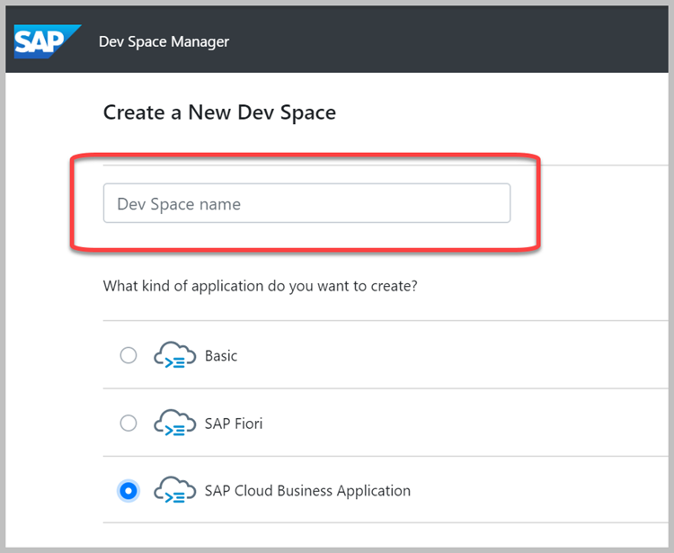

4. Choose **SAP Cloud Business Application**.

5. Choose **Create Dev Space**.

    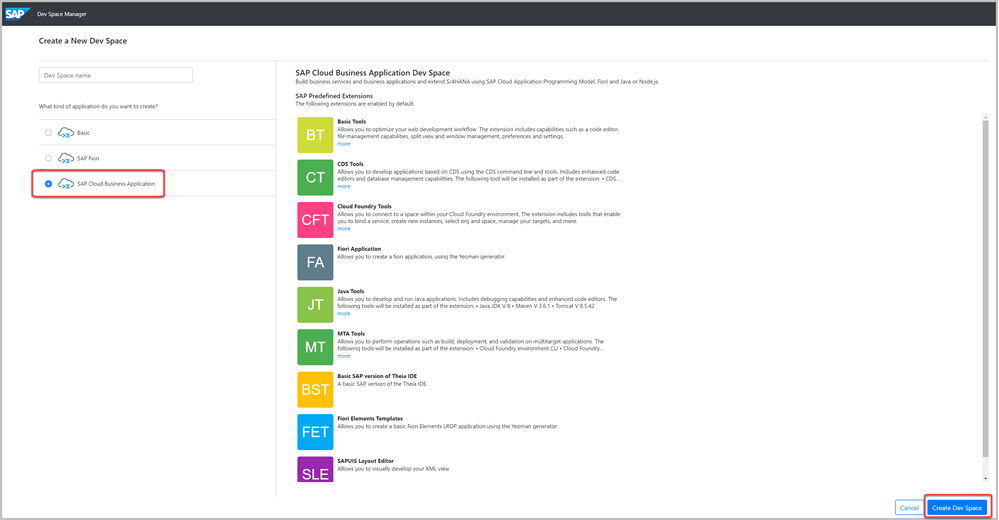

6. When the dev space is created and the status is **RUNNING**, click on the dev space name to load your dev space.

    

7. In the loaded dev space, open a terminal from the main menu. Choose **Terminal -> New Terminal**

    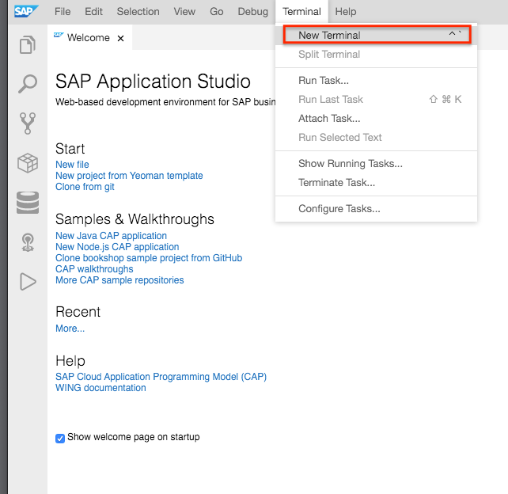

8. From the terminal, go into the **project** folder with:

    ```
    cd projects
    ```

    and execute the following:
    
    ```
    git clone --single-branch --branch CAA265-node-initial https://github.com/SAP-samples/cloud-cap-samples.git
    ```

9. Click on the file icon on the top left and choose **Open Workspace**:

   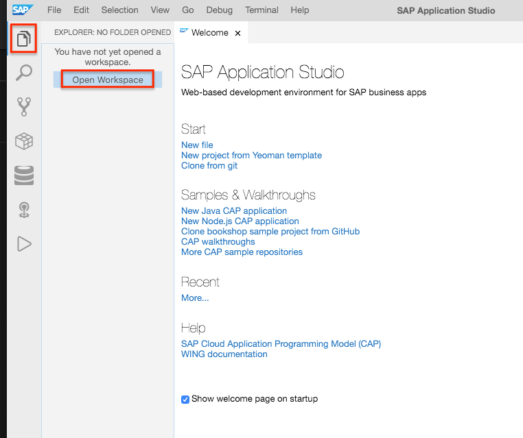
    
   a. Expand the **cloud-cap-samples** folder and choose **packages**.
   
     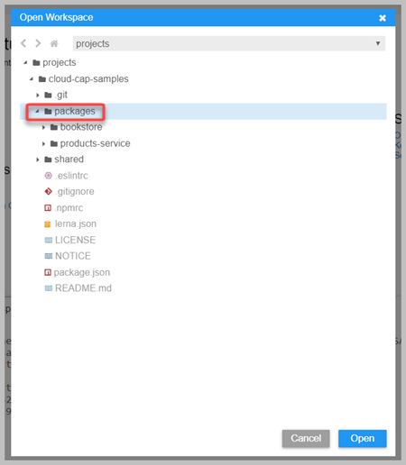
   
   b. Then choose **Open** to open the sample packages in your workspace. 
   
Now you are ready to continue with the implementation of the **bookstore** application.

### Part B: Define a domain model and reuse the products service

In your workspace you'll see two projects: 
  - **bookstore** - a project structure with the basic configuration for you to start developing your application
  - **products-service** - a CAP module already developed and ready to be reused

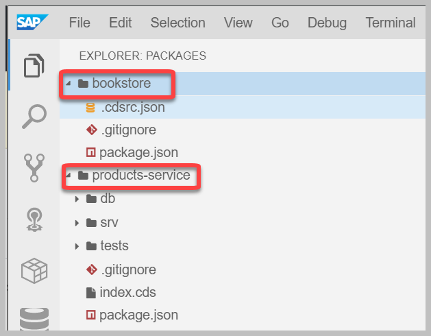

CAP allows you to reuse models from other packages in your project. This means you do not have to develop every functionality from scratch and you can save time to focus on your specific business logic. In our example, we are going to reuse the **products-service** from the repository we cloned. [More about packages reuse](https://cap.cloud.sap/docs/get-started/projects).

1. Open the `package.json` of the **bookstore** project. Under **dependencies** add: 

    ```"@sap/capire-products": "^1.0.0",```

   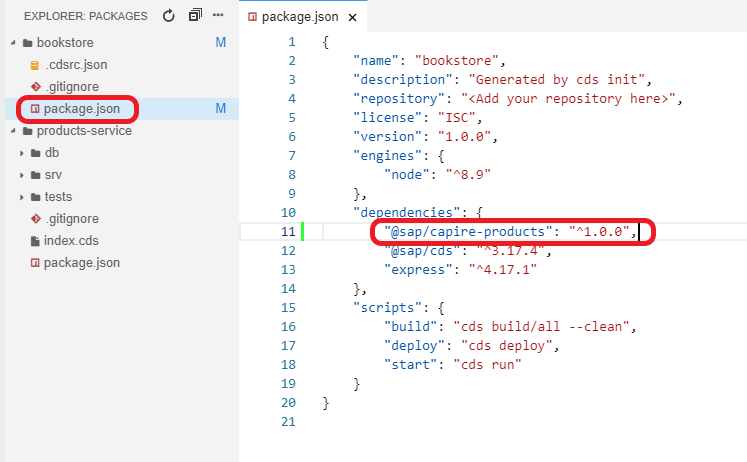

2. Now, you need to install all the needed dependencies. 

   a. Open a new terminal with **Terminal -> New Terminal**.
   
   b. Make sure you are in the **packages** folder (`cd packages`) and execute `npm install`.
   
   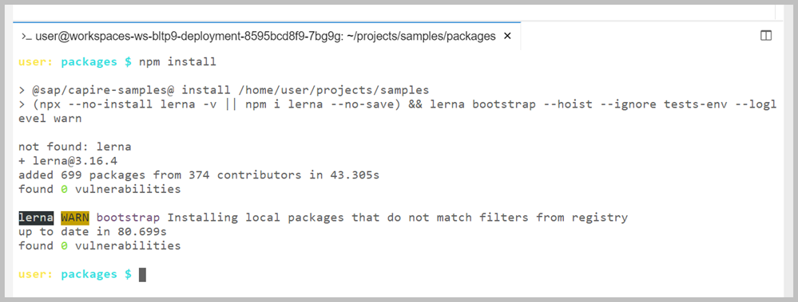

    You can now reuse entities defined in the products service in the domain model of the bookstore application.
    
    >Throughout these exercises we use Lerna to manage the installation of packages inside the monorepo.
    Therefore please make sure to always run `npm install` in the **packages** directory.

3. First, create a file for your domain model:
  
   a. Right-click on the **bookstore** project folder and choose **New File**.

    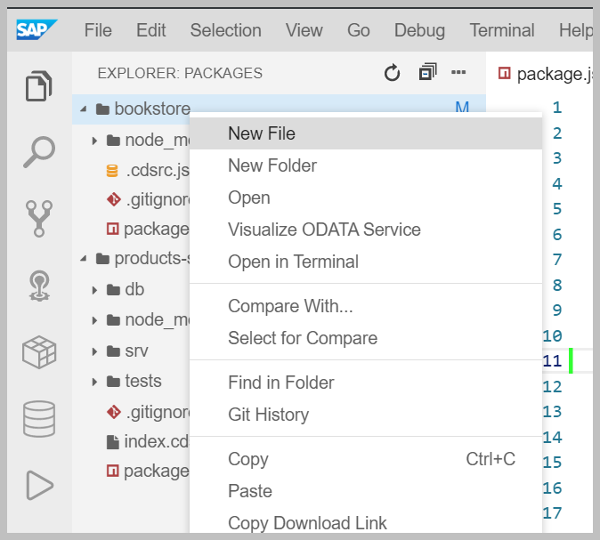

   b. Add `db/schema.cds` as the file name.
  
    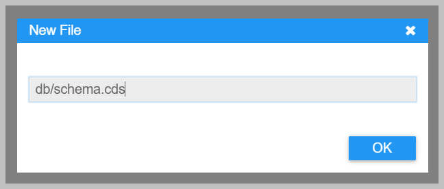
  
    This will create a **db** directory with one file called **schema.cds**.
      
4. In the `schema.cds` file add the following definitions:

    ```swift
    namespace sap.capire.bookstore;

    // We reuse Products, which are Books in our domain
    using { sap.capire.products.Products as Books } from '@sap/capire-products';
    using { Currency, managed } from '@sap/cds/common';

    extend Books with {
      author : Association to Authors;
    }

    entity Authors : managed {
      key ID : Integer;
      name   : String(111);
      dateOfBirth  : Date;
      dateOfDeath  : Date;
      placeOfBirth : String;
      placeOfDeath : String;
      books  : Association to many Books on books.author = $self;
    }

    entity Orders : managed {
      key ID : Integer;
      OrderNo  : String @title:'Order Number'; //> readable key
      Items    : Composition of many OrderItems on Items.parent = $self;
      total    : Decimal(9,2) @readonly;
      currency : Currency;
    }

    entity OrderItems {
      key ID : Integer;
      parent    : Association to Orders;
      book      : Association to Books;
      amount    : Integer;
      netAmount : Decimal(9,2);
    }
    ```

    As you can see, in our domain model we are creating three entities `Authors`, `Orders` and `OrderItems`. Since the products used in the bookstore are books, we are exposing `Products` from the `products-service` as `Books` with the declaration: `using { sap.capire.products.Products as Books } from '@sap/capire-products'`. In order to link authors to their books, we are extending the definition of `Books` with an association to `Authors` with: `extend Books with {[...]}`.

### Part C: Define a service and add sample data

In CAP, APIs are provided through services acting as facades for domain model entities. The best practice is to serve different use cases with different service facades and APIs. In this part of the exercise, we will create a CDS service definition for the bookstore catalog.

1. Create a file to add your service definitions:

   a. Right-click on the **bookstore** project folder and choose **New File**.

   b. Add `srv/services.cds` as the file name.

   This will create a **srv** directory with one file called **services.cds**.

2. In the `services.cds` file add the following content:

    ```swift
    namespace sap.capire.bookstore;

    using { sap.capire.products.Products, sap.capire.bookstore as my } from '../db/schema';

    service CatalogService {
      @readonly entity Books as projection on Products {
        *, category.name as category, author.name
      } excluding { createdBy, modifiedBy };

      @insertonly entity Orders as projection on my.Orders;
    }

    // Reuse services from @sap/capire-products...
    using { sap.capire.products.AdminService } from '@sap/capire-products';
    extend service AdminService with {
      entity Authors as projection on my.Authors;
    }
    ```

    This creates a service called `CatalogService` and exposes a read-only entity `Books` and an insert-only entity `Orders`.

    >For more details on the service definition, right-click the `services.cds` file and choose **Open in Service Modeler** from the context menu.
    >
    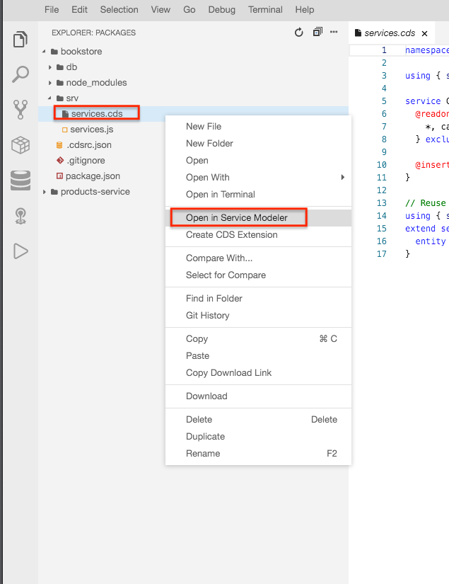
    >
    > This opens the CDS Service Modeler that let's you explore the modelled entities and their relationships.
    >
    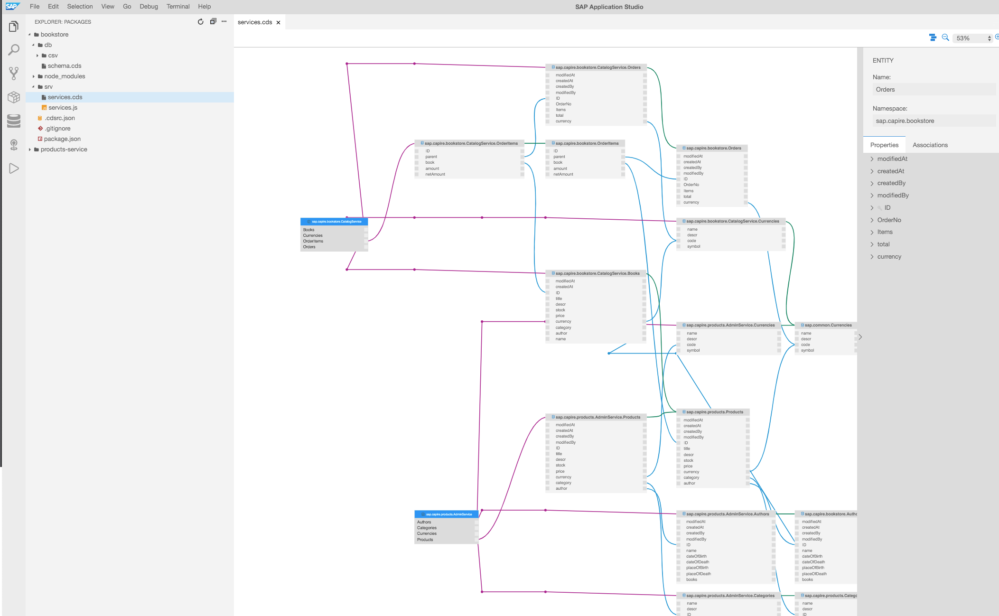   

    We have prepared an archive that contains `csv` files with sample data for the database.

3. Download [the archive](./resources/bookstore_csvs.zip) and extract the files to any desired location on your local machine.

   >Choose **Download** to save the zip file. Make sure you extract the files before continuing.

4. Create a folder for the csv files. 

   a. Right-click the **db** folder and choose **New Folder**. 
   
   b. Use **csv** as the folder name.

   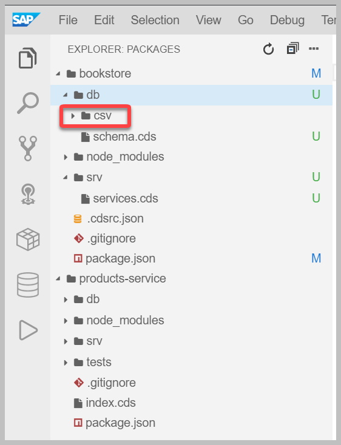

5. Right-click the **csv** folder, choose **Upload Files...** and select all of the unarchived CSV files.

   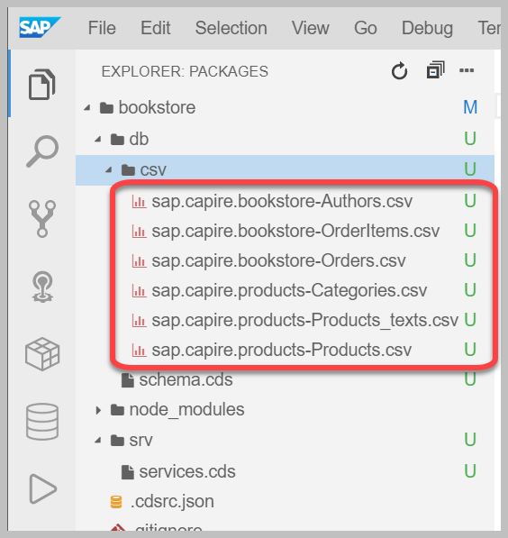

### Part D: Run the bookstore application

Up until this exercise, you have added a domain model, a service definition and sample data for a database. Now, it's time to run the bookstore application:

1. In the terminal execute `cds run bookstore --in-memory`

   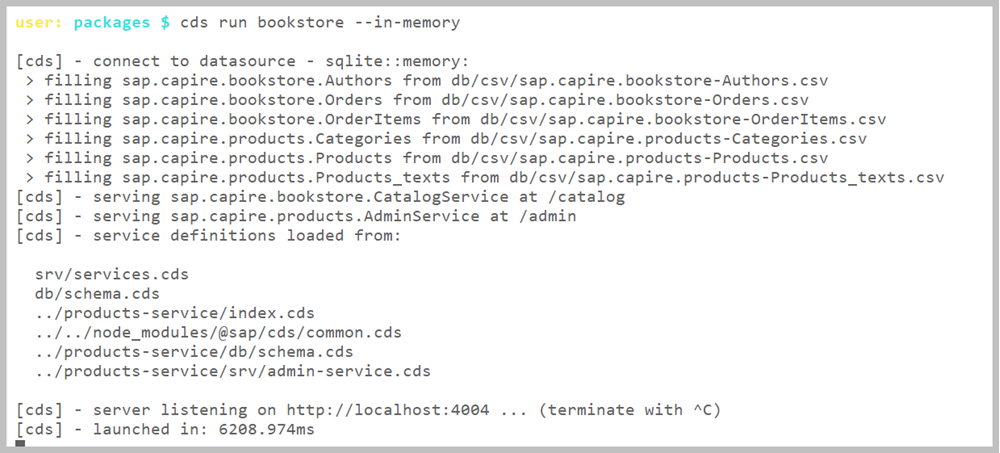

   This will run the bookstore application and load the sample data into an in-memory SQLite database.

2. When a pop-up menu appears at the bottom right of the page, click on **Expose and Open**

    
    
3. Specify a description - for example, **app-port**.

    

    > If you accidentally closed any of the popups in SAP Application Studio, press **Ctrl + Shift + P** (**Cmd + Shift + P**). In the dialog box, enter **Ports** and you will see a list of available options for managing ports.
    >
    >
    > With the **Ports: Preview** you can access all the exposed ports:
    >

4. The service opens in a new browser tab.

    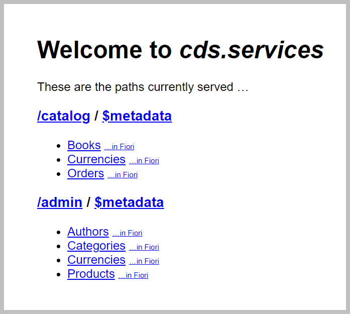

5. Choose **Books** in the catalog service to view the book products we just populated within the database.

   This sends a request to `catalog/Books` to show the data.

    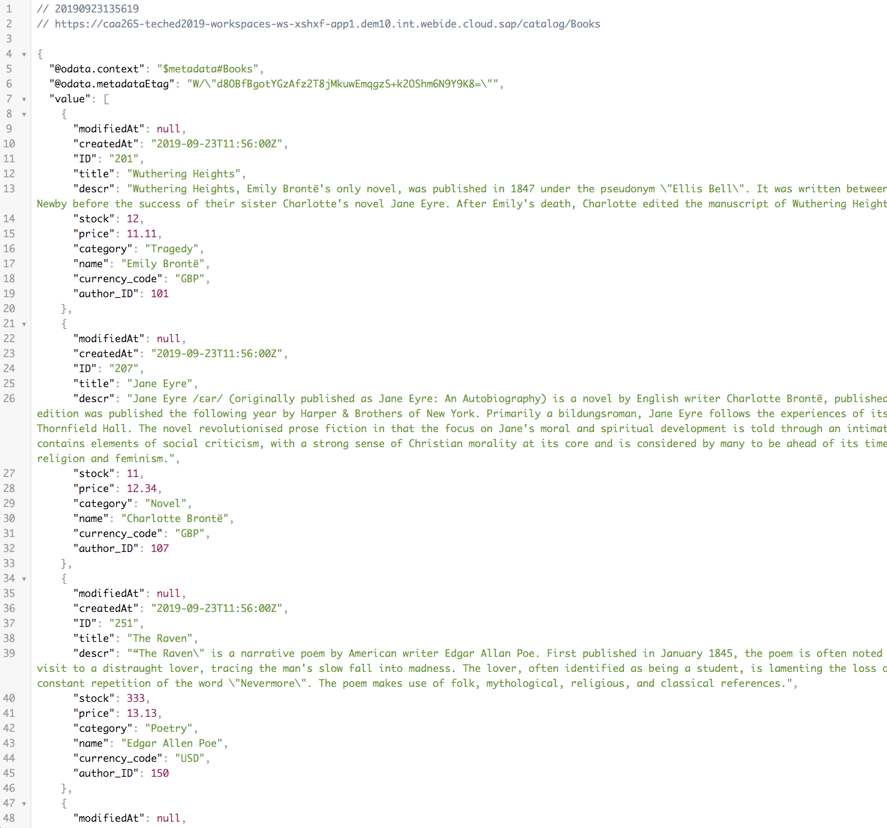
    
    >In the screenshot above, the result JSON is formatted by the Google Chrome extension "JSON Viewer".

Great job! Your bookstore application is up and running! Now, let's test it out a bit.

### Part E: Add custom logic and debug the bookstore application

   The response to `catalog/Books` is implemented by the generic event handlers provided by CAP. We can also register custom event  handlers to add custom logic.
   
   Now, we will add a simple handler for our catalog service.

1. Right click the **srv** folder and create a new file called `services.js` with the following content:

    ```js
    const cds = require('@sap/cds')
    module.exports = async (srv) => {

      const { Books } = srv.entities
      // Check all amounts against stock before activating
      srv.before(['CREATE', 'UPDATE'], 'Orders', (req) => {
        const tx = cds.transaction(req), order = req.data
        return Promise.all(order.Items.map(each => tx.run(
          UPDATE(Books).where({ ID: each.book_ID })
            .and(`stock >=`, each.amount)
            .set(`stock -=`, each.amount)
        ).then(affectedRows => {
          if (!affectedRows) {
            req.error(409, `${each.amount} exceeds stock for book #${each.book_ID}`)
          }
        })))
      })
    }
    ```

   With **srv.before()** we defined a custom handler that is executed before the CAP generic event handler. With this custom handler for every updated and created order the stock of books is reduced by the ordered amount. If there is not enough stock to fullfil the order, an error is thrown and the request is rejected.

2. Now let's stop the application and start debugging.

   a. Go to the terminal, press `Ctrl + C` to stop the running **bookstore** application.
   
   b. From the side panel open the **Run configurations** view.

   

   c. Click on the plus icon to create a new configuration.

   

   d. From the dropdown menu with services, choose **bookstore**

   

   e. When you hover over the newly create configuration a green play button appears. Click on it to run the app.

   

   A pop-up appears once the application is running. Choose **Open in new tab**
   
   From the **Run Configurations** menu a CAP application can be debugged.
   
   f. From the side menu, go back to the Project Explorer.
   
   g. Open the `service.js` file and set a breakpoint on line 14 where the error is shown.
   
    
    
   h. Stop and run the application again directly from the debug panel.
      
3. Let's fire a request to test the custom logic you just developed.

   a. Open a new terminal from the menu **Terminal** -> **New Terminal** and execute:

    ```
    curl -X POST http://localhost:4004/catalog/Orders \
    -H "Content-Type: application/json;IEEE754Compatible=true" \
    -d '{"ID":1111,"OrderNo":"3","Items":[{"ID":304,"amount":600,"netAmount":"8400","book_ID":"252"}]}'
    ```

    With this request we are trying to order 600 copies of the book "Eleonora" from Edgar Allen Poe. The problem is that there is not enough stock. The debugger stops at the breakpoint where is the error is thrown. 
    
    b. To continue running the service, choose **continue**.
    
    
       
   c. Go to the **Node Debug Console**. 
   
   As expected, the response states that the request cannot be completed, because it exceeds the current stock.

   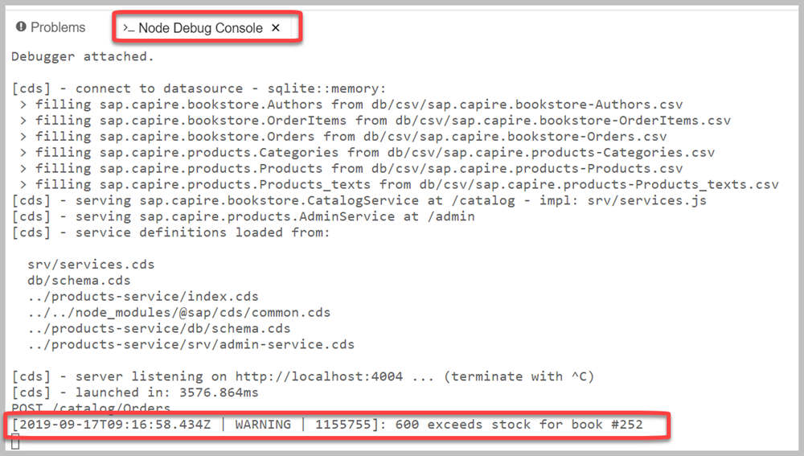

   [Learn more about custom handlers here.](https://cap.cloud.sap/docs/node.js/api#cds-event-handlers)

### Congratulations!

You just developed your first CAP application and learned how to reuse packages and completed Exercise 1. In [Exercise 2](../exercise02/README.md) you will develop a CAP service that we will use later in the bookshop application.
